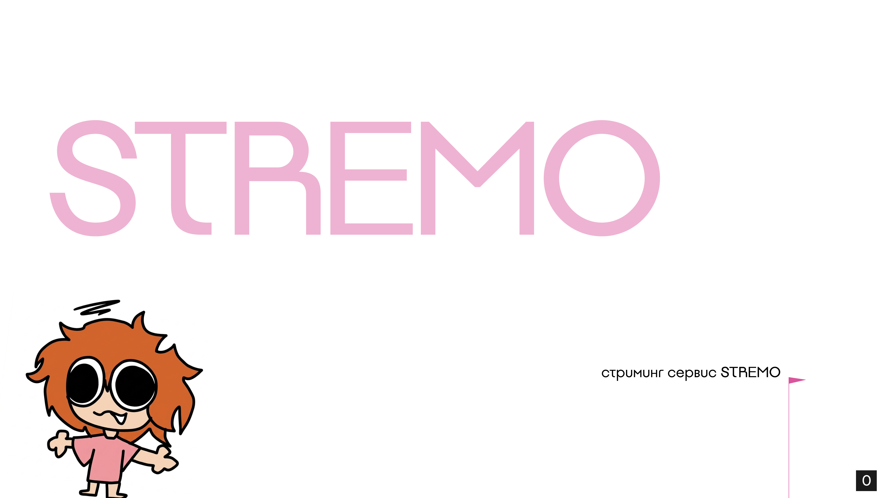

# **STREMO**

<div align="center">


<br>


</div>



>[!IMPORTANT]
> Данные проект был разработан в рамках дисциплины "ЯПиСД" в виде расчетно графической работы первого курса ФПМИ \
> STREMO — это амбициозный стартап и интерактивная стриминговая платформа для геймеров, креаторов и их аудитории. Зародившись как смелый студенческий проект, STREMO стремится стать площадкой с самым отзывчивым и сплоченным комьюнити. Уже на этапе открытого тестирования STREMO объединяет десятки талантливых стримеров и тысячи зрителей. Наша серверная инфраструктура, обеспечивающая трансляции с минимальной задержкой, постоянно масштабируется. В этом году мы запустили полноценный функционал для создателей контента и предлагаем пользователям удобный инструментарий для проведения прямых эфиров.


## Быстрый запуск

**Git Clone**

```bash
git clone https://github.com/CS151512/STREMO.git
cd STREMO
```

> [!IMPORTANT]
> Полная документация есть в папке docs, а также в makefile есть `make help`, которая описывает весь список команд


## Документация

Проект обладает разветвленной архитектурой, поэтому документация разбита на специализированные разделы:

<table width="100%">
  <tr>
    <td width="50%" valign="top">
      <a href="./docs/Archicture.md">
        
      </a><br><br>
      Верхнеуровневое устройство системы, взаимодействие C++ ядра и брокера Kafka.
    </td>
    <td width="50%" valign="top">
      <a href="./docs/API.md">
        
      </a><br><br>
      Спецификации контрактов, описание эндпоинтов и форматов передачи данных.
    </td>
  </tr>
  <tr>
    <td width="50%" valign="top">
      <a href="./docs/DataBase.md">
        
      </a><br><br>
      Схемы таблиц PostgreSQL, механизмы кэширования в Redis и модели данных.
    </td>
    <td width="50%" valign="top">
      <a href="./docs/Sharding.md">
        
      </a><br><br>
      Стратегии распределения данных, партицирование и масштабирование хранилища.
    </td>
  </tr>
  <tr>
    <td width="50%" valign="top">
      <a href="./docs/Deploy.md">
        
      </a><br><br>
      Инструкции по сборке, локальному запуску и настройке k3s кластера с Terraform.
    </td>
    <td width="50%" valign="top">
      <a href="./docs/CI-CD.md">
        
      </a><br><br>
      Пайплайны автоматического тестирования, сборки образов и доставки кода.
    </td>
  </tr>
  <tr>
    <td width="50%" valign="top">
      <a href="./docs/srs/">
        
      </a><br><br>
      Расчетно-графическая часть: спецификации и формулы (доступны в формате PDF и TeX).
    </td>
    <td width="50%" valign="top">
      <a href="./docs/User.md">
        
      </a><br><br>
      Описание клиентской части, ролей пользователей и базовых сценариев использования.
    </td>
  </tr>
</table>


## Математические модели и спецификаци

В данном разделе представлено формальное математическое описание работы алгоритмов обработки данных, оценка асимптотической сложности и спецификации структур данных для проекта **STREMO**.

<div align="center">
  <table>
    <tr>
      <td align="center" width="50%">
        <br>
        <a href="./STREMO_Math.pdf">
          
        </a>
        <br><br>
        <i>(Рекомендуется для проверки)</i>
      </td>
      <td align="center" width="50%">
        <br>
        <a href="./main.tex">
          
        </a>
        <br><br>
        <i>(Директория с .tex файлами)</i>
      </td>
    </tr>
  </table>
</div>

---

## Самостоятельная сборка из исходников

Если вы хотите скомпилировать PDF-документ локально, убедитесь, что у вас установлен дистрибутив TeX (например, TeX Live или MiKTeX) и выполните следующую команду в этой директории:

```bash
pdflatex main.tex
# Рекомендуется запустить дважды для корректной сборки оглавления и ссылок
pdflatex main.tex
```

---
**by finnik & s1gmagor**
