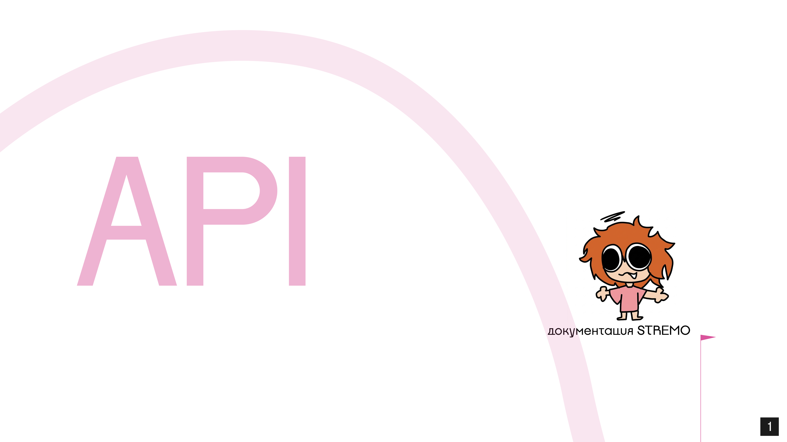

# Структура и Спецификация API



>[!IMPORTANT]
> Данная спецификация является единым источником истины (SSOT) для взаимодействия с API платформы STREMO. Документ разбит по микросервисам. Для каждой ручки приведены полные примеры JSON-ответов для всех возможных статусов (успешных и ошибок).

>[!NOTE]
> **Базовый URL:** `https://api.stremo.com/v1`
> Все закрытые эндпоинты требуют заголовок: `Authorization: Bearer <JWT_TOKEN>`

---

## **Auth-service**

> Данный сервис отвечает за безопасность платформы. Он управляет регистрацией, выдачей и ротацией JWT-токенов, сессиями пользователей, а также интеграциями со сторонними провайдерами (**OAuth 2.0**) и двухфакторной аутентификацией (**Mobile ID**).

#### *Классическая регистрация* `POST /auth/register`

Создает новую учетную запись пользователя.

**Request Body**

| Поле | Тип | Обяз. | Описание и Валидация |
| :--- | :--- | :--- | :--- |
| `email` | `string` | Да | Контактный email. Формат: валидный email (RFC 5322). Макс. 255 символов. |
| `username` | `string` | Да | Уникальный никнейм. Только a-z, 0-9 и `_`. Длина: от 3 до 25 символов. |
| `password` | `string` | Да | Мин. 8 символов, обязательно 1 заглавная буква, 1 строчная, 1 цифра, 1 спецсимвол. |

Примеры ответов

>[!TIP]
> **201 CREATED (OK)**
> ```json
> {
>  "id": "usr-550e8400-e29b-41d4-a716-446655440000",
>  "message": "User successfully registered. Please check your email for verification."
> }
> ```

>[!CAUTION]
> **400 Bad Request**
> ```json
> {
>  "error": {
>    "code": "VALIDATION_FAILED",
>    "message": "Введенные данные не соответствуют требованиям",
>    "details": [
>      {
>        "field": "password",
>        "issue": "Пароль должен содержать как минимум один спецсимвол"
>      }
>    ],
>    "request_id": "req-99f5a-4b12"
>  }
> }
> ```
>
> **409 Conflict**
> ```json
> {
>  "error": {
>    "code": "USER_ALREADY_EXISTS",
>    "message": "Пользователь с такими данными уже существует",
>    "details": [
>      {
>        "field": "username",
>        "issue": "Никнейм streamer_pro уже занят"
>      }
>    ],
>    "request_id": "req-99f5b-5c23"
>  }
> }
> ```

#### *Авторизация* `POST /auth/login`

Проверяет учетные данные и возвращает пару токенов для доступа к API.

**Request Body**

| Поле | Тип | Обяз. | Описание |
| :--- | :--- | :--- | :--- |
| `email` | `string` | Да | Email пользователя. |
| `password` | `string` | Да | Пароль в открытом виде. |

Примеры ответов

>[!TIP]
> **200 OK**
> ```json
> {
>  "access_token": "eyJhbGciOiJIUzI1NiIsInR5cCI...", // Короткоживущий токен для запросов
>  "refresh_token": "def50200508a8a4f8d5...", // Долгоживущий токен для обновления сессии
>  "expires_in": 900, // Время жизни access_token в секундах (15 минут)
>  "token_type": "Bearer"
> }
> ```

>[!CAUTION]
> **401 Unauthorized**
> ```json
> {
>  "error": {
>    "code": "INVALID_CREDENTIALS",
>    "message": "Неверный email или пароль",
>    "request_id": "req-11a2b-3c44"
>  }
> }
> ```
>
> **403 Forbidden**
> ```json
> {
>  "error": {
>    "code": "ACCOUNT_BANNED",
>    "message": "Ваш аккаунт был перманентно заблокирован",
>    "request_id": "req-11a2b-3c45"
>  }
> }
> ```
>
> **429 Too Many Requests**
> ```json
> {
>  "error": {
>    "code": "RATE_LIMIT_EXCEEDED",
>    "message": "Слишком много неудачных попыток входа. Попробуйте через 15 минут.",
>    "request_id": "req-11a2b-3c46"
>  }
> }
> ```

#### *Инициализация Mobile ID (Беспарольный вход / 2FA)* `POST /auth/mobile-id/init`

Отправляет Push-уведомление на телефон пользователя через провайдера связи.

**Request Body**

| Поле | Тип | Обяз. | Описание и Валидация |
| :--- | :--- | :--- | :--- |
| `phone_number` | `string` | Да | Номер телефона в формате E.164 (например, `+12345678900`). |

Примеры ответов

>[!TIP]
> **202 Accepted**
> ```json
> {
>  "session_id": "mob-999888", // Сохраните этот ID для проверки статуса авторизации
>  "control_code": "4512", // Покажите этот код пользователю на экране!
>  "expires_in": 120 // Сессия сгорит через 120 секунд
> }
> ```

>[!CAUTION]
> **404 Not Found**
> ```json
> {
>  "error": {
>    "code": "PHONE_NOT_REGISTERED",
>    "message": "Данный номер телефона не привязан ни к одному аккаунту",
>    "request_id": "req-22b3c-4d55"
>  }
> }
> ```

---

## **User-profile-service**

> Микросервис управляет публичной и приватной информацией о пользователях.

#### *Получение профиля текущего пользователя* `GET /users/me`

Возвращает полную информацию об авторизованном пользователе. Запрос требует JWT токен.

Примеры ответов

>[!TIP]
> **200 OK**
> ```json
> {
>  "id": "usr-123",
>  "username": "streamer_pro",
>  "email": "user@example.com", // Возвращается только владельцу
>  "bio": "Professional CS2 player",
>  "avatar_url": "https://cdn.stremo.com/avatars/usr-123.png",
>  "followers_count": 1500,
>  "is_verified": true // Галочка верификации канала
> }
> ```

>[!CAUTION]
> **401 Unauthorized**
> ```json
> {
>  "error": {
>    "code": "UNAUTHORIZED",
>    "message": "Токен доступа не передан или истек",
>    "request_id": "req-33c4d-5e66"
>  }
> }
> ```

#### *Загрузка аватара* `POST /users/me/avatar`

Загружает новое изображение профиля в S3 хранилище. `Content-Type: multipart/form-data`.

Примеры ответов

>[!TIP]
> **200 OK**
> ```json
> {
>  "avatar_url": "https://cdn.stremo.com/avatars/usr-123_new.png",
>  "message": "Аватар успешно обновлен"
> }
> ```

>[!CAUTION]
> **400 Bad Request**
> ```json
> {
>  "error": {
>    "code": "UNSUPPORTED_FILE_TYPE",
>    "message": "Разрешены только форматы JPEG, PNG и WebP",
>    "request_id": "req-44d5e-6f77"
>  }
> }
> ```
>
> **413 Payload Too Large**
> ```json
> {
>  "error": {
>    "code": "FILE_TOO_LARGE",
>    "message": "Размер файла превышает лимит в 5 МБ",
>    "request_id": "req-44d5e-6f78"
>  }
> }
> ```

---

## **Billing-service**

> Микросервис обрабатывает транзакции с балансом (донат Bits, подписки).

#### *Отправка доната (Bits) на стрим* `POST /billing/donate`

Списывает внутреннюю валюту со счета зрителя и переводит стримеру.

**Request Body**

| Поле | Тип | Обяз. | Описание и Валидация |
| :--- | :--- | :--- | :--- |
| `channel_id` | `string` | Да | UUID стримера, которому предназначается донат. |
| `amount_bits` | `integer` | Да | Количество отправляемой валюты. Минимум: 10, Максимум: 500,000. |
| `message` | `string` | Нет | Сообщение для стримера. Макс. 255 символов. |

Примеры ответов

>[!TIP]
> **200 OK**
> ```json
> {
>  "transaction_id": "txn-abc123def456",
>  "remaining_balance": 4500, // Новый баланс зрителя после списания
>  "message": "Донат успешно отправлен"
> }
> ```

>[!CAUTION]
> **400 Bad Request**
> ```json
> {
>  "error": {
>    "code": "AMOUNT_TOO_LOW",
>    "message": "Минимальная сумма доната составляет 10 Bits",
>    "request_id": "req-55e6f-7a88"
>  }
> }
> ```
>
> **402 Payment Required**
> ```json
> {
>  "error": {
>    "code": "INSUFFICIENT_FUNDS",
>    "message": "На вашем балансе недостаточно Bits для совершения операции",
>    "details": [
>      {
>        "field": "amount_bits",
>        "issue": "Требуется 500, доступно 150"
>      }
>    ],
>    "request_id": "req-55e6f-7a89"
>  }
> }
> ```
>
> **404 Not Found**
> ```json
> {
>  "error": {
>    "code": "CHANNEL_NOT_FOUND",
>    "message": "Стример с указанным ID не найден",
>    "request_id": "req-55e6f-7a90"
>  }
> }
> ```

---

## **Stream-meta-service**

> Микросервис управляет метаданными эфира, категориями и каталогом трансляций.

#### *Изменение метаданных трансляции* `PUT /streams/{stream_id}/meta`

Обновляет карточку стрима. Рассылает WebSocket событие всем текущим зрителям.

**Request Body**

| Поле | Тип | Обяз. | Описание и Валидация |
| :--- | :--- | :--- | :--- |
| `title` | `string` | Да | Название стрима (от 1 до 140 символов). |
| `category_id` | `string` | Да | ID игры (например, `cs2`). |

Примеры ответов

>[!TIP]
> **200 OK**
> ```json
> {
>  "stream_id": "str-987",
>  "title": "Road to Global Elite | CS2",
>  "category_id": "cs2",
>  "updated_at": "2026-05-20T10:05:00Z"
> }
> ```

>[!CAUTION]
> **400 Bad Request**
> ```json
> {
>  "error": {
>    "code": "CATEGORY_NOT_FOUND",
>    "message": "Указанная категория игры не существует в базе",
>    "request_id": "req-66f7a-8b11"
>  }
> }
> ```
>
> **403 Forbidden**
> ```json
> {
>  "error": {
>    "code": "NOT_STREAM_OWNER",
>    "message": "У вас нет прав на редактирование этой трансляции",
>    "request_id": "req-66f7a-8b12"
>  }
> }
> ```

#### *Список активных трансляций (Каталог)* `GET /streams/live`

Возвращает список текущих эфиров. Поддерживает курсорную пагинацию.

Примеры ответов

>[!TIP]
> **200 OK**
> ```json
> {
>  "data": [
>    {
>      "stream_id": "str-987",
>      "user": {
>        "id": "usr-123",
>        "username": "streamer_pro",
>        "avatar_url": "https://cdn.stremo.com/avatars/usr-123.png"
>      },
>      "title": "Grand Final!",
>      "category": {"id": "cs2", "name": "Counter-Strike 2"},
>      "viewers": 15405, // Текущий онлайн (CCV) обновляется раз в 15 секунд
>      "thumbnail_url": "https://cdn.stremo.com/thumbs/str-987.jpg", // Скриншот потока (обновляется раз в 5 минут)
>      "tags": ["esports", "ru"],
>      "is_mature": false
>    }
>  ],
>  "next_cursor": "YXNkcW..." // Использовать в следующем GET запросе для подгрузки при скролле вниз
> }
> ```

---

## **Chat-service**

> Микросервис доставляет текстовые сообщения сотням тысяч зрителей в реальном времени.

#### *Получение истории сообщений* `GET /chat/{channel_id}/history`

Запрашивается клиентом сразу после подключения к WS для инициализации окна чата.

Примеры ответов

>[!TIP]
> **200 OK**
> ```json
> {
>  "messages": [
>    {
>      "id": "msg-001",
>      "author": "viewer1",
>      "text": "Привет стример!",
>      "badges": ["subscriber", "vip"], // Значки пользователя
>      "timestamp": "2026-05-20T10:00:00Z"
>    },
>    {
>      "id": "msg-002",
>      "author": "viewer2",
>      "text": "GG WP",
>      "badges": [],
>      "timestamp": "2026-05-20T10:00:05Z"
>    }
>  ]
> }
> ```

>[!CAUTION]
> **404 Not Found**
> ```json
> {
>  "error": {
>    "code": "CHANNEL_NOT_FOUND",
>    "message": "Чат для данного канала не найден",
>    "request_id": "req-77a8b-9c22"
>  }
> }
> ```

---

## **Moderation-service**

> Обрабатывает выдачу банов, таймаутов и автоматическую проверку сообщений на спам.

#### *Принудительный бан в чате* `POST /moderation/channels/{channel_id}/ban`

Блокирует пользователя на канале и выкидывает его из WebSocket соединения.

**Request Body**

| Поле | Тип | Обяз. | Описание и Валидация |
| :--- | :--- | :--- | :--- |
| `user_id` | `string` | Да | ID пользователя-нарушителя. |
| `reason` | `string` | Нет | Причина бана (остается в логах для апелляции). |
| `delete_recent` | `boolean` | Нет | Если `true`, удаляет все сообщения пользователя за последние 10 минут. По умолчанию `true`. |

Примеры ответов

>[!TIP]
> **200 OK**
> ```json
> {
>  "status": "banned",
>  "target_user_id": "usr-badguy",
>  "moderator_id": "usr-mod123",
>  "message": "Пользователь забанен, его недавние сообщения удалены"
> }
> ```

>[!CAUTION]
> **403 Forbidden**
> ```json
> {
>  "error": {
>    "code": "MISSING_PERMISSIONS",
>    "message": "У вас нет прав модератора для выполнения этого действия",
>    "request_id": "req-88b9c-0d33"
>  }
> }
> ```
>
> **409 Conflict**
> ```json
> {
>  "error": {
>    "code": "ALREADY_BANNED",
>    "message": "Этот пользователь уже забанен на данном канале",
>    "request_id": "req-88b9c-0d34"
>  }
> }
> ```

---

## **Analytics-service**

> Считает статистику в реальном времени (CCV) и агрегирует метрики.

#### *Статистика стрима* `GET /analytics/streams/{stream_id}/summary`

Возвращает бизнес-показатели завершенной или текущей трансляции для стримера.

Примеры ответов

>[!TIP]
> **200 OK**
> ```json
> {
>  "stream_id": "str-987",
>  "peak_viewers": 16500, // Пиковый онлайн
>  "average_viewers": 12400, // Средний онлайн
>  "new_followers": 340, // Сколько новых подписчиков пришло
>  "revenue_bits": 45000, // Заработано Bits
>  "revenue_fiat": 120.50 // Заработано фиата (с платных подписок)
> }
> ```

>[!CAUTION]
> **403 Forbidden**
> ```json
> {
>  "error": {
>    "code": "ACCESS_DENIED",
>    "message": "Вы можете просматривать аналитику только своих трансляций",
>    "request_id": "req-99c0d-1e44"
>  }
> }
> ```

---

## **Notification-service**

> Управляет колокольчиком (In-App уведомления).

#### *Список уведомлений* `GET /notifications`

Возвращает список непрочитанных уведомлений.

Примеры ответов

>[!TIP]
> **200 OK**
> ```json
> {
>  "data": [
>    {
>      "id": "notif-001",
>      "type": "stream_started", // Тип уведомления
>      "title": "streamer_pro начал трансляцию!",
>      "body": "Заходи смотреть Road to Global Elite",
>      "action_url": "https://stremo.com/streamer_pro",
>      "created_at": "2026-05-20T09:00:00Z",
>      "is_read": false
>    }
>  ],
>  "unread_count": 1
> }
> ```

>[!CAUTION]
> **401 Unauthorized**
> ```json
> {
>  "error": {
>    "code": "UNAUTHORIZED",
>    "message": "Требуется авторизация для просмотра уведомлений",
>    "request_id": "req-00d1e-2f55"
>  }
> }
> ```

---

## **Vod-manager-service**

> Микросервис управляет доступом к сохраненным записям прошлых трансляций (Video on Demand) и клипам.

#### *Список записей канала* `GET /vods/channel/{channel_id}`

Возвращает список сохраненных видео выбранного канала. Поддерживает пагинацию.

Примеры ответов

>[!TIP]
> **200 OK**
> ```json
> {
>  "data": [
>    {
>      "vod_id": "vod-8877",
>      "title": "Grand Final CS2",
>      "duration_seconds": 14400, // Длительность: 4 часа
>      "views": 5400,
>      "thumbnail_url": "https://cdn.stremo.com/vod-thumbs/vod-8877.jpg",
>      "created_at": "2026-05-19T18:00:00Z"
>    }
>  ],
>  "next_cursor": "QWVyZ..."
> }
> ```

>[!CAUTION]
> **404 Not Found**
> ```json
> {
>  "error": {
>    "code": "CHANNEL_NOT_FOUND",
>    "message": "Запрашиваемый канал не существует",
>    "request_id": "req-11a2b-3c88"
>  }
> }
> ```

---

## **Ingest-service**

> Микросервис отвечает за прием видео-потока по протоколам RTMP/SRT. Включает API для управления настройками потока.

#### *Получение ключа трансляции* `GET /ingest/me/key`

Возвращает секретный Stream Key для настройки OBS.

Примеры ответов

>[!TIP]
> **200 OK**
> ```json
> {
>  "stream_url": "rtmp://ingest.stremo.com/live",
>  "stream_key": "live_123456_abcdef9876543210" // Секретный ключ!
> }
> ```

>[!CAUTION]
> **401 Unauthorized**
> ```json
> {
>  "error": {
>    "code": "UNAUTHORIZED",
>    "message": "Для получения ключа трансляции необходимо авторизоваться",
>    "request_id": "req-22b3c-4d99"
>  }
> }
> ```

---

## **Transcoder-service (Внутреннее API)**

> Микросервис принимает команды от Ingest Service и отвечает за запуск изолированных воркеров FFmpeg. Недоступен из внешней сети.

#### *Вебхук готовности HLS-плейлиста* `POST /internal/v1/transcoder/status`

Отправляется воркером, когда видеопоток успешно сконвертирован в различные качества (1080p, 720p) и HLS (.m3u8) чанки загружены в S3.

**Request Body**

| Поле | Тип | Обяз. | Описание и Валидация |
| :--- | :--- | :--- | :--- |
| `stream_id` | `string` | Да | ID текущей трансляции. |
| `status` | `string` | Да | Статус транскодинга: `processing`, `completed`, `error`. |
| `master_playlist_url` | `string` | Нет | URL к HLS master.m3u8 плейлисту. |

Примеры ответов

>[!TIP]
> **200 OK**
> ```json
> {
>  "message": "Status updated successfully",
>  "ack": true
> }
> ```

>[!CAUTION]
> **422 Unprocessable Entity**
> ```json
> {
>  "error": {
>    "code": "INVALID_PAYLOAD",
>    "message": "Отсутствуют обязательные параметры",
>    "request_id": "req-internal-abc-123"
>  }
> }
> ```

---

## **Smtp-service (Внутреннее API)**

> Микросервис изолирует всю логику по отправке транзакционных писем. Вызывается по сети кластера (cluster.local) другими сервисами (например, Auth Service).

#### *Отправка письма по шаблону* `POST /internal/v1/mail/send`

Добавляет письмо в очередь на отправку.

**Request Body**

| Поле | Тип | Обяз. | Описание |
| :--- | :--- | :--- | :--- |
| `to` | `string` | Да | Email получателя. |
| `template_id` | `string` | Да | ID HTML-шаблона. |
| `variables` | `object` | Да | JSON-объект с переменными для подстановки в шаблон. |

Примеры ответов

>[!TIP]
> **202 Accepted**
> ```json
> {
>  "status": "queued",
>  "job_id": "job-555123", // Внутренний ID задачи в брокере (Kafka/Redis)
>  "message": "Письмо добавлено в очередь на отправку"
> }
> ```

>[!CAUTION]
> **400 Bad Request**
> ```json
> {
>  "error": {
>    "code": "TEMPLATE_ERROR",
>    "message": "Не переданы обязательные переменные шаблона: username",
>    "request_id": "req-internal-xyz-999"
>  }
> }
> ```
>
> **500 Internal Server Error**
> ```json
> {
>  "error": {
>    "code": "SMTP_GATEWAY_ERROR",
>    "message": "Не удалось подключиться к внешнему провайдеру (SendGrid/Mailgun)",
>    "request_id": "req-internal-err-500"
>  }
> }
> ```


---
*by finnik*
