# Архитектура Платформы STREMO

>[!IMPORTANT]
> Данная спецификация является единым источником истины (SSOT) для высокоуровневой и низкоуровневой архитектуры стриминговой платформы STREMO. Документ описывает глобальную топологию, паттерны проектирования, потоки данных и внутреннее устройство каждого ключевого микросервиса.

>[!NOTE]
> Основной технологический стек бэкенда: **C++20**. Выбор обусловлен необходимостью детерминированного управления памятью, отсутствием пауз сборщика мусора (GC) при обработке видеопотоков в реальном времени и максимальной производительностью сетевого слоя (Boost.Asio / gRPC).

---

## **1. Глобальная Топология Платформы**

Система разделена на независимые домены (Video, Core, Interactive). Весь внешний трафик проходит через Edge-балансировщики, фильтруется и перенаправляется на внутренние C++ микросервисы.

```mermaid
%%{init: {"theme": "base", "look": "handDrawn", "flowchart": {"rankSpacing": 160, "nodeSpacing": 15}}}%%
flowchart LR
    classDef default fill:#fff,stroke:#000,stroke-width:2px,color:#000
    classDef dashedRed fill:#fff,stroke:#d63031,stroke-width:2px,stroke-dasharray: 6 6,color:#d63031,rx:15,ry:15
    classDef dashedBlack fill:#fff,stroke:#000,stroke-width:2px,stroke-dasharray: 6 6,color:#000,rx:15,ry:15
    classDef solidBlack fill:#fff,stroke:#000,stroke-width:2px,color:#000,rx:15,ry:15
    classDef storage fill:#fdfdfd,stroke:#555,stroke-width:2px,color:#000,rx:5,ry:5

    Streamers("Streamers\n(OBS)"):::default
    Users("Viewers\n(Web/App)"):::default

    Streamers -->|"RTMP: TCP 1935"| TCPProxy("tcp_proxy\n(HAProxy)"):::dashedRed
    TCPProxy -->|"Raw Stream"| Ingest("ingest_service\n(C++)"):::solidBlack
    Ingest -->|"IPC / Shared Mem"| Transcoder("transcoder_service\n(FFmpeg)"):::solidBlack
    Transcoder -->|"PUT /hls/*.ts"| S3("s3_storage\n(Multi-AZ)"):::storage

    Users -->|"GET /master.m3u8"| CDN("cloud_cdn\n(Edge Cache)"):::dashedBlack
    CDN -.->|"Cache Miss"| S3

    Users -->|"REST API (HTTPS)"| Nginx("nginx\n(Ingress, WAF)"):::dashedRed
    Nginx -->|"Rate Limited"| BFF("BFF_service\n(API Gateway)"):::dashedBlack
    
    BFF -->|"gRPC: VerifyToken"| Auth("auth_service"):::solidBlack
    BFF -->|"gRPC: GetProfile"| User("user_service"):::solidBlack
    BFF -->|"gRPC: GetMeta"| StreamMeta("stream_meta_service"):::solidBlack
    BFF -->|"gRPC: GetClips"| VOD("vod_service"):::solidBlack
    BFF -->|"gRPC: Checkout"| Billing("billing_service"):::solidBlack
    
    Auth & User & StreamMeta & VOD & Billing --> DB("postgresql_cluster\n(Sharded by: channel_id)"):::storage

    Users -.->|"WSS: /ws/events"| Nginx
    Nginx -->|"Upgrade WSS"| Chat("chat_service\n(WebSockets)"):::solidBlack
    
    Chat -->|"PUBLISH chat:{id}"| Redis("redis_cluster\n(Pub/Sub & Hot State)"):::storage
    Chat -.->|"gRPC: Check Spam"| Mod("mod_service\n(ML Filters)"):::solidBlack

    Ingest -.->|"gRPC: Report CCV"| Analytics("analytics_service\n(Aggregator)"):::solidBlack
    Analytics -->|"INSERT Batch (5s)"| Clickhouse("clickhouse\n(ReplicatedMergeTree)"):::storage

    Ingest -.->|"Verify Stream Key"| StreamMeta
    Ingest -.->|"stream.started"| Kafka("kafka_bus\n(Partitions: 32)"):::storage
    Billing -.->|"payment.received"| Kafka
    Mod -.->|"user.banned"| Kafka
    
    Kafka -.->|"Consume Events"| Notify("notify_service\n(WebPush/SSE)"):::solidBlack
    Notify -.->|"Push Alert"| Users
```

---

## **2. Детальная Архитектура Доменов и Микросервисов**

Каждый микросервис спроектирован с учетом изоляции отказов (Fault Isolation) и возможности независимого горизонтального масштабирования (Horizontal Pod Autoscaling).

### **2.1. Домен Стриминга: Видео Пайплайн (Ingest & Transcoder)**

Самый ресурсоемкий узел платформы. Цель пайплайна — получить сырой видеопоток, конвертировать его в различные разрешения (Adaptive Bitrate) и доставить зрителям с минимальной задержкой.

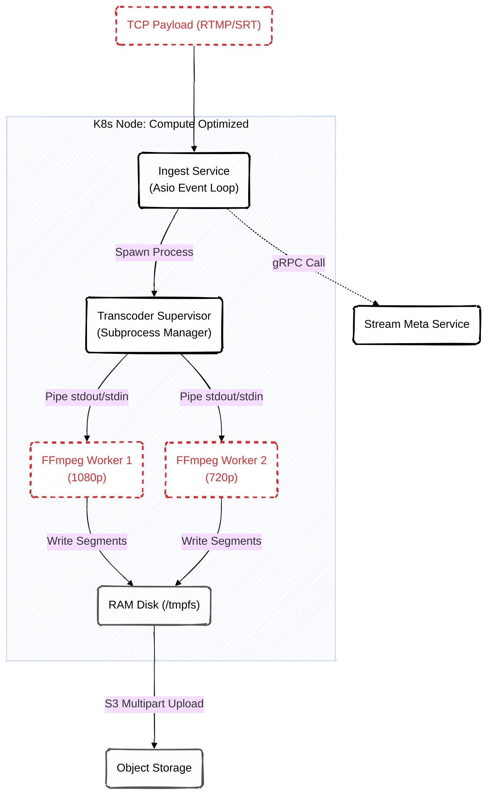

**Как это работает:**
1.  **Ingest Service (Прием):** Терминирует RTMP соединение. Первым делом делает синхронный gRPC вызов в `stream-meta-service` для валидации Stream Key. Если ключ неверен, TCP соединение моментально сбрасывается.
2.  **Transcoder Supervisor:** Если ключ валиден, Ingest порождает (fork/exec) новые процессы FFmpeg. Связь между Ingest и FFmpeg идет через анонимные пайпы (IPC/Pipes), что исключает сетевые задержки внутри узла.
3.  **HLS & RAM Disk:** FFmpeg нарезает видео на чанки (2 секунды). Чтобы не изнашивать SSD сервера тысячами операций записи в секунду, чанки пишутся в оперативную память (RAM Disk / `tmpfs`).
4.  **Upload:** Фоновый воркер асинхронно выгружает готовые файлы из `tmpfs` в S3. По завершении загрузки манифеста вызывается webhook-уведомление внутреннего API платформы.

>[!CAUTION]
> **Привязка к железу (Node Affinity)**
> Поды Ingest и Transcoder разворачиваются строго на узлах Kubernetes с маркировкой `video-optimized`. Эти узлы имеют мощные процессоры и аппаратные энкодеры GPU (NVENC), проброшенные в контейнер через драйверы NVIDIA.

---

### **2.2. Домен Интерактива: Чат и Модерация (Realtime Pub/Sub)**

Домен чата должен выдерживать скачкообразные нагрузки (Thundering Herd) во время масштабных киберспортивных турниров (до 500,000 онлайна).

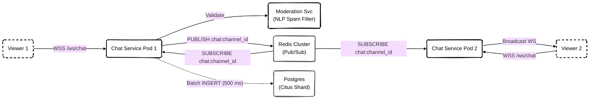

**Как это работает:**
1.  **WebSocket Балансировка:** Балансировщик нагрузки (Ingress) распределяет WSS-соединения зрителей случайным образом по сотням экземпляров (подов) `chat-service`.
2.  **Синхронизация через Redis:** Когда зритель отправляет сообщение на `ChatPod1`, этот под обязан доставить его всем остальным зрителей в этой же комнате. Под публикует сообщение в Redis-канал `chat:<channel_id>`.
3.  **Рассылка (Fan-Out):** Все остальные поды (например, `ChatPod2`), которые держат соединения зрителей из этого же канала, подписаны на этот Redis-канал. Они получают событие и пересылают его в открытые WebSocket-сокеты своих клиентов.
4.  **Сжатие базы данных:** Чтобы не перегрузить базу одиночными инсертами, каждый под накапливает сообщения в кольцевом буфере памяти и сбрасывает их в PostgreSQL одним `COPY` или многострочным `INSERT` запросом раз в полсекунды.

>[!TIP]
> **Автоматический Slow Mode**
> Если Redis фиксирует превышение лимита (например, больше 100 сообщений в секунду для одного канала), `chat-service` автоматически включает "Slow Mode", заставляя клиентов выжидать паузу перед отправкой, чтобы предотвратить деградацию UI на фронтенде.

---

### **2.3. Домен Биллинга: Гарантия согласованности (Transactional Outbox)**

Биллинг работает с реальными деньгами и внутренней валютой (Bits). Ключевая проблема здесь — двойная запись (Dual Write): необходимость изменить баланс в базе данных и гарантированно отправить уведомление в шину событий (Kafka).

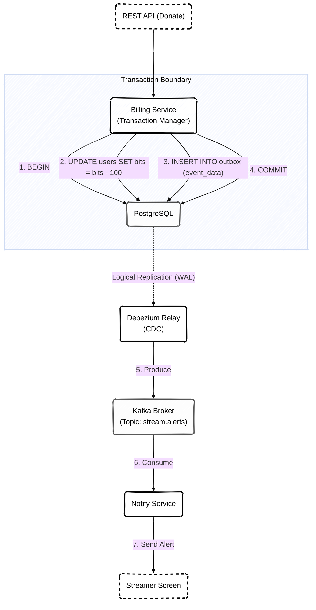

**Как это работает:**
1.  **ACID Транзакция:** Биллинг открывает транзакцию в PostgreSQL. Он списывает деньги со счета и *в этой же транзакции* записывает факт совершения платежа (событие для алерта) в системную таблицу `outbox`.
2.  **Гарантия целостности:** Если транзакция откатится (сбой сети, нехватка средств), событие не сохранится в `outbox`. Если зафиксируется — событие гарантированно в базе.
3.  **CDC (Change Data Capture):** Процесс Debezium непрерывно читает журнал упреждающей записи (WAL) PostgreSQL. Как только в таблице `outbox` появляется новая строка, Debezium конвертирует ее в событие Kafka.
4.  **Семантика At-Least-Once:** Даже если `billing-service` упадет сразу после `COMMIT`, система CDC все равно отправит событие в Kafka, гарантируя, что алерт доната обязательно появится на экране стримера.

---

## **3. Архитектура Остальных Микросервисов**

Помимо трех основных высоконагруженных доменов, описанных выше, платформа состоит из набора специализированных микросервисов. Ниже представлены схемы их внутреннего устройства.

### **3.1. Auth Service (Сервис Аутентификации)**

Отвечает за генерацию токенов, хеширование паролей и интеграцию с провайдерами связи для 2FA.

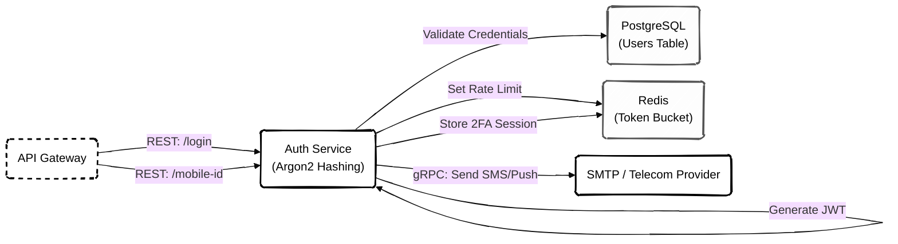

### **3.2. User Profile Service (Сервис Профилей)**

Обрабатывает запросы на получение публичной информации о каналах и управление подписками (фолловерами).

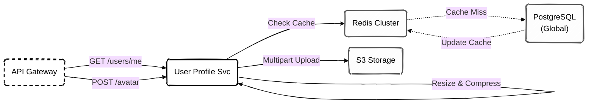

### **3.3. Stream Meta Service (Сервис Метаданных)**

Хранит каталог стримов, названия, категории и обеспечивает быстрый поиск (Keyset Pagination) для главной страницы.

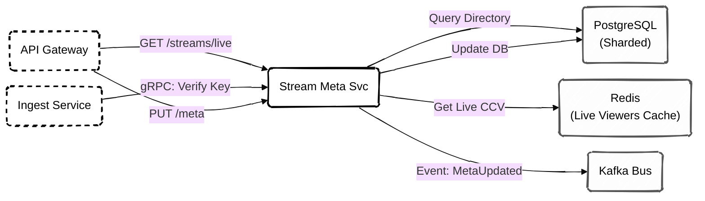

### **3.4. Moderation Service (Сервис Модерации)**

Работает в связке с чатом. Использует NLP (Natural Language Processing) модели для автоматической фильтрации спама.

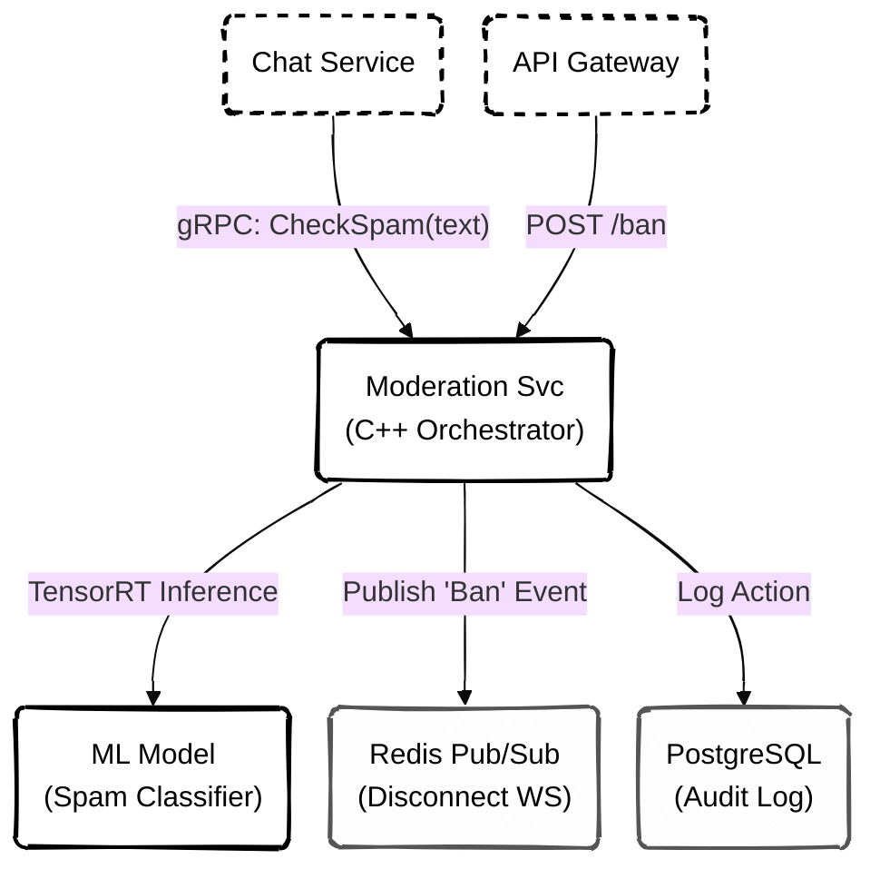

### **3.5. Analytics Service (Сервис Аналитики)**

Считает онлайн (CCV) и строит агрегированные графики для стримеров. Из-за высоких нагрузок на запись использует ClickHouse.

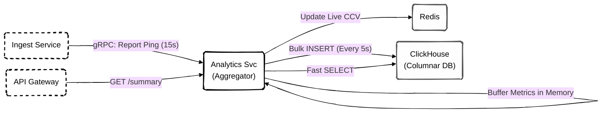

### **3.6. Notification Service (Сервис Уведомлений)**

Читает события из шины данных и превращает их в In-App уведомления или мобильные Push-сообщения.

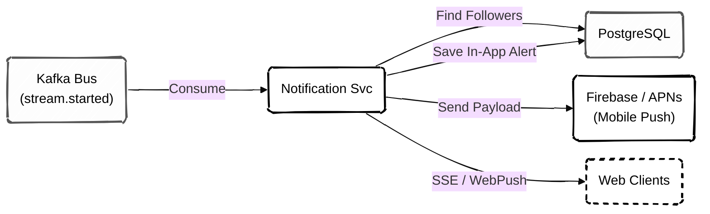

### **3.7. VOD Manager Service (Управление Записями)**

Предоставляет API для доступа к прошлым стримам (VOD) и создания коротких клипов из длинных трансляций.

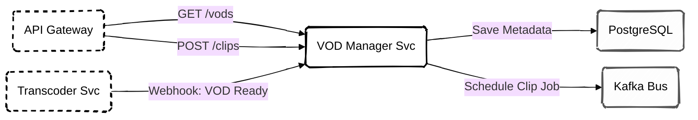

### **3.8. SMTP Service (Внутренний Почтовый Шлюз)**

Изолирует логику рендеринга HTML шаблонов и общения с внешними провайдерами электронной почты. Никакой другой сервис не имеет прямого доступа к интернету для отправки писем.

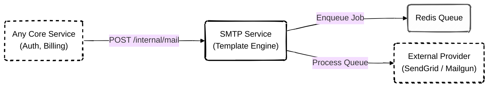

---

## **4. Хранение Данных и Шардирование**

Платформа избегает единой точки отказа (SPOF) на уровне хранения данных.

*   **Global Database (PostgreSQL):** Содержит критически важные, но редко изменяемые данные. Это таблицы пользователей, паролей, ролей, балансов и истории транзакций. База работает в режиме Primary-Replica.
*   **Sharded Database (PostgreSQL + Citus Data):** Содержит огромные объемы данных: историю чата, VOD-клипы, статистику и просмотры. Данные горизонтально распределены по нескольким узлам кластера на основе ключа распределения (`channel_id` или `stream_id`). Запросы маршрутизируются на нужный шард прозрачно для приложения.
*   **ClickHouse (Аналитика):** База данных столбцового типа (Columnar). Используется сервисом `analytics-service` для агрегации метрик. Принимает широкие инсерты (CCV, показы рекламы) и позволяет строить графики для дашборда стримера за миллисекунды.

---

## **5. Сводный Технологический Стек**

| Слой | Технология | Бизнес-обоснование выбора |
| :--- | :--- | :--- |
| **Backend Core** | C++20 | Ручное управление ресурсами. Использование корутин (coroutines) и современных библиотек (Boost.Asio) для предсказуемой задержки и высокой пропускной способности. |
| **Внутреннее RPC** | gRPC (Protobuf) | Строгая типизация контрактов между командами разработчиков. Бинарная сериализация снижает нагрузку на сеть в 10 раз по сравнению с REST/JSON. |
| **API Gateway** | Go / Node.js | Паттерн BFF (Backend for Frontend). Терминирует внешние JWT токены, агрегирует данные с разных gRPC сервисов и отдает фронтенду удобный JSON. |
| **Видео Ядро** | FFmpeg (C API) | Индустриальный стандарт транскодинга. Позволяет тонко управлять пресетами кодеков (x264/NVENC) для достижения оптимального качества ABR. |
| **Кэш / PubSub** | Redis 7 (Cluster) | Хранение "горячих" данных (сессии, профили), реализация Token Bucket (Rate Limit) и шина обмена сообщениями для чата (Pub/Sub). |
| **Брокер Событий** | Apache Kafka | Развязка микросервисов (Decoupling) и гарантия доставки (Event Sourcing). Выдерживает колоссальные объемы записей без деградации производительности. |
| **Инфраструктура** | Kubernetes (K8s) | Оркестрация контейнеров, изоляция ресурсов, автоматический Horizontal Pod Autoscaling (HPA) воркеров в зависимости от нагрузки. |
