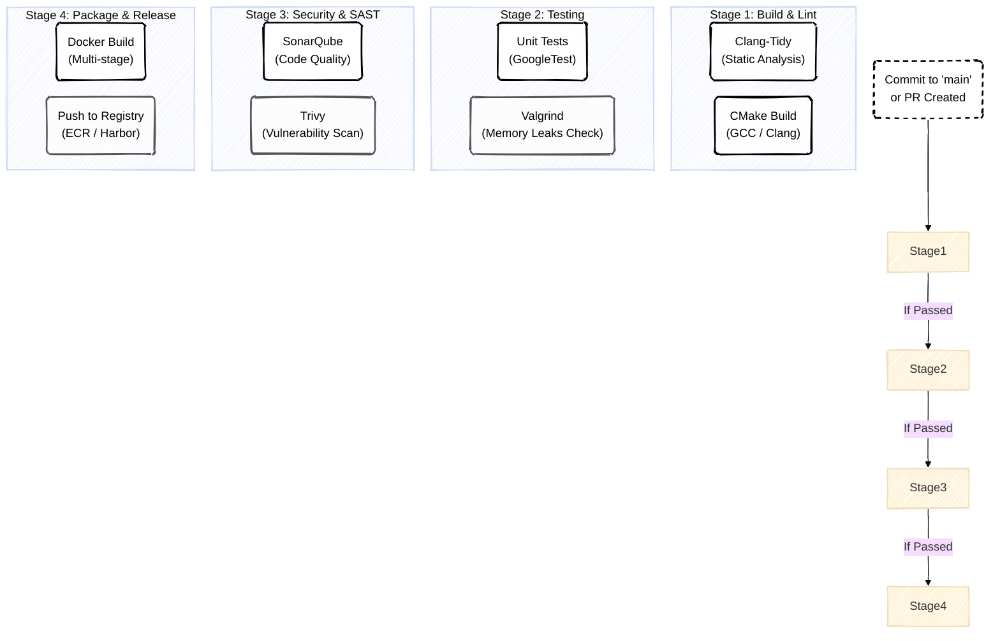
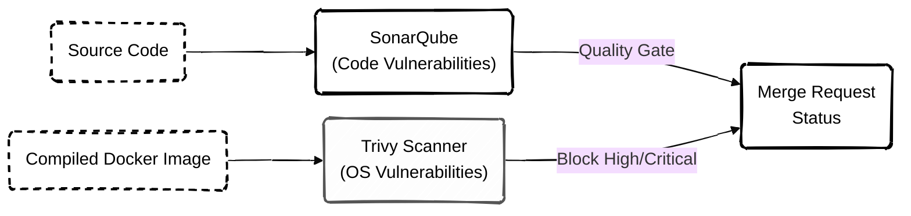

# Непрерывная Интеграция и Качество Кода (CI Pipeline)

>[!IMPORTANT]
> Данный документ детализирует процессы, происходящие с кодом до его попадания в среду развертывания (которая описана в `Deploy.md`). Строгий CI-пайплайн гарантирует, что в Production попадет только проверенный, безопасный и оптимизированный код.

---

## **1. Архитектура CI Пайплайна (GitLab CI / GitHub Actions)**

Пайплайн запускается автоматически при создании Pull Request (Merge Request) или коммите в ветку `main`. Для C++ микросервисов процесс сборки и тестирования разделен на жесткие этапы (Stages), каждый из которых блокирует дальнейшее продвижение при возникновении ошибки.

---

## **2. Детализация Этапов (Stages)**

### **2.1. Сборка и Линтинг (Build & Lint)**

Кодовая база C++20 требует строгих стандартов форматирования и проверки на этапе компиляции.

*   **Clang-Format:** Проверяет код на соответствие `.clang-format` файлу проекта (стандарт Google C++ Style Guide с локальными модификациями).
*   **Clang-Tidy:** Ловит потенциальные баги до компиляции (например, неинициализированные переменные, опасные приведения типов, нарушения `const-correctness`).
*   **Компиляция:** Сборка происходит через CMake. В пайплайне всегда включен флаг `-Werror` (считать Warnings ошибками), чтобы код с предупреждениями не мог быть слит в `main`.

### **2.2. Тестирование и Анализ Памяти (Testing)**

Отказоустойчивость сервисов реального времени (In-Memory буферы, WebSockets) критически зависит от работы с памятью.

*   **GoogleTest (GTest):** Запускает набор Unit-тестов для бизнес-логики.
*   **Valgrind / AddressSanitizer (ASan):** Бинарный файл запускается в специальном окружении для поиска утечек памяти (Memory Leaks), обращений к освобожденной памяти (Use-After-Free) и состояний гонки (Race Conditions).

>[!CAUTION]
> **Блокировка пайплайна (Quality Gate)**
> Покрытие Unit-тестами (Code Coverage) должно быть не ниже 80%. Если покрытие падает ниже этого порога, пайплайн завершается с ошибкой (`exit 1`), и слияние ветки (Merge Request) автоматически блокируется.

---

## **3. Безопасность и SAST (Security Scanning)**

STREMO обрабатывает платежные данные и трансляции, поэтому безопасность интегрирована прямо в процесс сборки (Shift-Left Security).

*   **SonarQube (SAST):** Анализирует исходный код на уязвимости (например, SQL Injection, Buffer Overflow) и технический долг (Code Smell).
*   **Trivy (Container Scanning):** После того как Docker-образ собран, Trivy сканирует его слои на предмет уязвимостей в системных библиотеках (CVE). Если найдены уязвимости уровня `CRITICAL` или `HIGH` в базовом образе, пуш в Registry блокируется.

---

## **4. Оптимизация Docker-образов (Multi-Stage Build)**

Поскольку C++ требует тяжелых компиляторов и библиотек (Boost, FFmpeg dev-headers), мы используем **Multi-Stage Builds** для создания финального образа, который пойдет в Production.

1.  **Stage 1 (Builder):** Использует тяжелый образ (`ubuntu` или `debian` с GCC/Clang, CMake, Conan/vcpkg). Здесь компилируется бинарный файл.
2.  **Stage 2 (Runtime):** Использует минималистичный образ `distroless/cc` (образ без shell, пакетного менеджера и лишних библиотек). В него копируется только скомпилированный бинарный файл и нужные `.so` файлы.

>[!TIP]
> **Преимущества Distroless:**
> Финальный образ микросервиса весит около 20-30 МБ вместо 1 ГБ+. Это кардинально ускоряет время запуска пода (Cold Start) в Kubernetes во время автомасштабирования (HPA) и сводит площадь атаки (Attack Surface) практически к нулю (внутри контейнера нет даже `bash`).