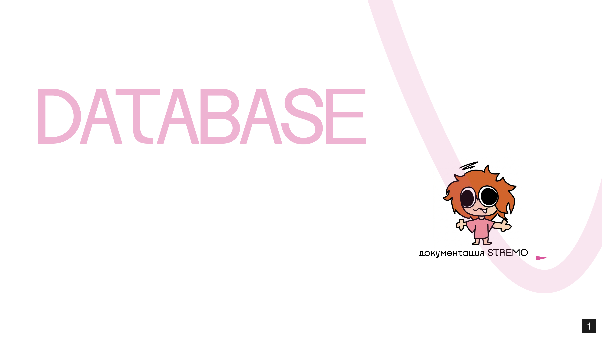
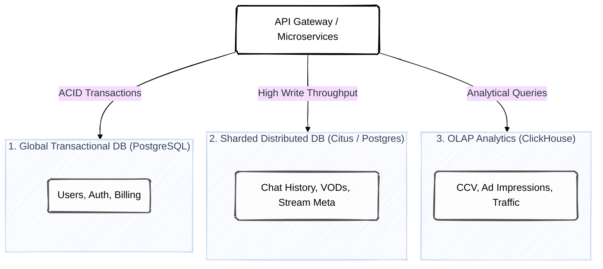
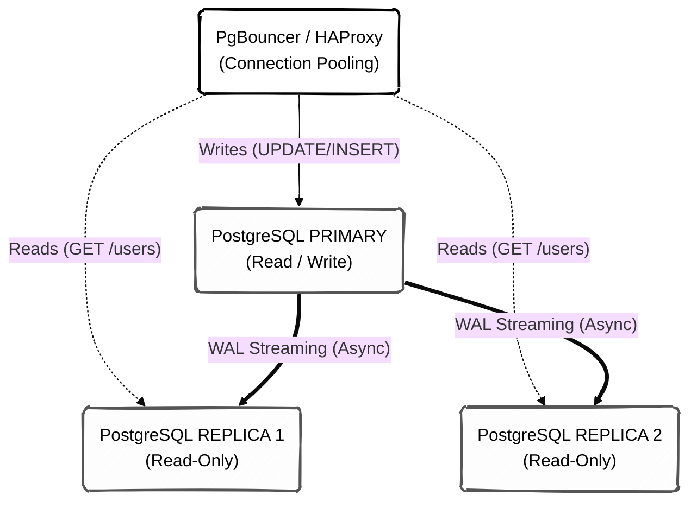
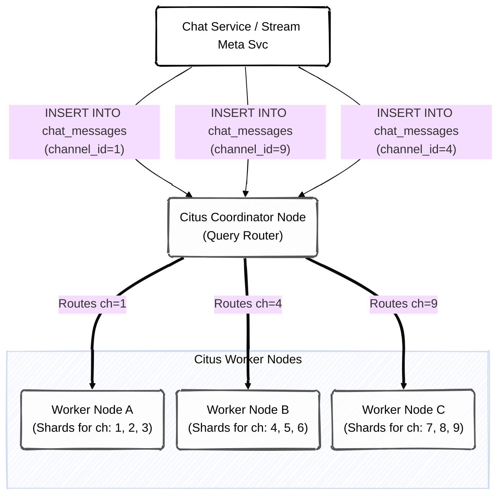
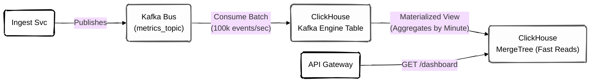

# Архитектура Баз Данных STREMO

>[!IMPORTANT]
> База данных — самый критичный компонент платформы. STREMO использует подход гибридного хранения данных (Polyglot Persistence). Документ описывает разделение на Глобальный кластер (для транзакций) и Шардированный кластер (для тяжелых данных), а также механизмы репликации и отказоустойчивости.

---

## **1. Глобальная Топология Данных**

Чтобы избежать бутылочного горлышка (Bottleneck) при росте платформы, данные строго разделены на три независимых кластера в зависимости от паттерна их использования (Read-Heavy, Write-Heavy или Analytical).

---

## **2. Глобальный Кластер (PostgreSQL)**

Этот кластер хранит "золотые данные" платформы. Здесь происходят финансовые операции, хранятся профили, пароли и настройки. 
*   **Паттерн:** Read-Heavy (часто читают профили, редко меняют).
*   **Требования:** Строгий ACID, гарантия отсутствия потерь при сбоях.

### **2.1 Схема Репликации (High Availability)**

Для обеспечения доступности (HA) используется асинхронная потоковая репликация (Streaming Replication) с автоматическим переключением (Failover) через Patroni или PgBouncer.

### **2.2 Основные Таблицы Глобального Кластера**

*   `users`: ID, email, хэш пароля, дата регистрации.
*   `profiles`: bio, avatar_url, настройки уведомлений.
*   `wallets`: баланс fiat, баланс Bits (строгие транзакционные блокировки `SELECT FOR UPDATE`).
*   `outbox_events`: системная таблица для паттерна Transactional Outbox (события для отправки в Kafka).
*   `followers`: связь Many-to-Many между зрителями и каналами.

---

## **3. Шардированный Кластер (Citus Data)**

Самая большая проблема стриминговой платформы — чат. Если 100,000 человек одновременно пишут в разные чаты, один мастер-сервер PostgreSQL не выдержит нагрузки на запись (Write-Heavy). Мы решаем это с помощью расширения **Citus**, которое превращает PostgreSQL в распределенную СУБД.

### **3.1 Принцип Шардирования (Horizontal Scaling)**

Данные разбиваются на части (шарды) и распределяются по разным физическим серверам (Worker Nodes). 
*   **Ключ распределения (Distribution Key):** `channel_id`.
*   **Почему `channel_id`?** Это гарантирует, что вся история чата конкретного стримера, все его клипы и метаданные его стрима будут лежать на **одном физическом диске**. Это позволяет делать быстрые локальные `JOIN` запросы без пересылки данных по сети между нодами.

### **3.2 Основные Таблицы Шардированного Кластера**

*   `chat_messages`: ID сообщения, `channel_id` (Sharding Key), `user_id`, текст, timestamp.
*   `streams`: ID трансляции, `channel_id` (Sharding Key), title, category, status.
*   `vods`: сохраненные видео, привязаны к `channel_id`.
*   `moderation_actions`: баны и таймауты (распределены по `channel_id` для быстрого доступа во время стрима).

>[!TIP]
> **Автоматическая балансировка**
> При добавлении новых серверов в кластер, Citus автоматически в фоновом режиме (не прерывая работу платформы) перенесет часть шардов на новые сервера, размазывая нагрузку.

---

## **4. ClickHouse (Слой Аналитики)**

Аналитика требует совершенно другого подхода. Стример хочет видеть график "Сколько зрителей было на каждой минуте моего 10-часового стрима". PostgreSQL будет выполнять такой запрос очень долго, сканируя миллионы строк.
**ClickHouse** решает это благодаря столбцовому хранению и векторизованным вычислениям.

### **4.1 Почему ClickHouse?**
1.  **Огромная скорость вставки:** Способен "заглатывать" сотни тысяч метрик в секунду напрямую из Kafka (через встроенный Kafka Table Engine).
2.  **Агрегация на лету:** Данные о зрителях сбрасываются каждую секунду. ClickHouse (через Materialized Views) автоматически сжимает их, вычисляя средний и пиковый онлайн (CCV) за каждую минуту.
3.  **Экономия диска:** Столбцовые данные отлично сжимаются (в 3-5 раз лучше, чем в PostgreSQL).

---

## **5. Механизмы Кэширования (Redis Cluster)**

Базы данных не должны обрабатывать 100% трафика. Все частые запросы экранируются кластером Redis 7.

*   **Token Bucket:** Хранит лимиты Rate Limit (защита от DDoS).
*   **Pub/Sub:** Мгновенная рассылка сообщений чата между подами Kubernetes (данные не сохраняются в Redis, только маршрутизируются).
*   **Сессии и JWT:** Список отозванных токенов (Blacklist).
*   **Live Directory:** Список активных стримов для Главной страницы обновляется в Redis каждую секунду. БД не участвует в рендеринге каталога.
