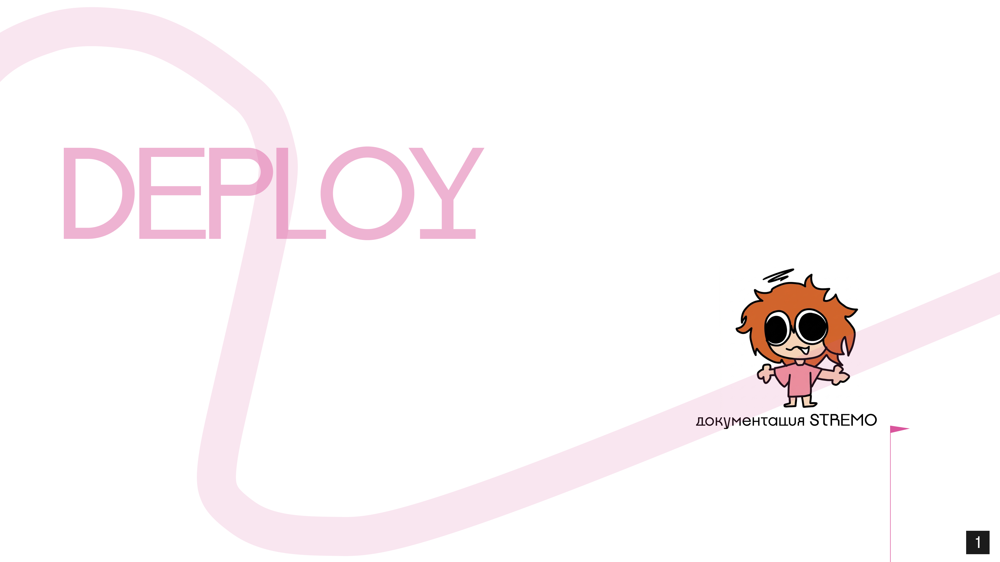
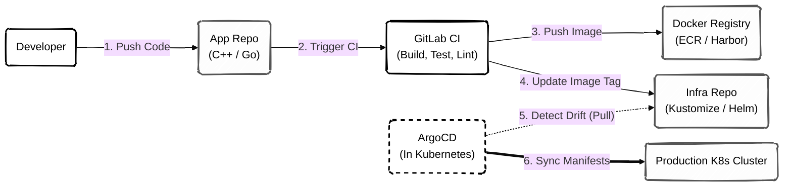
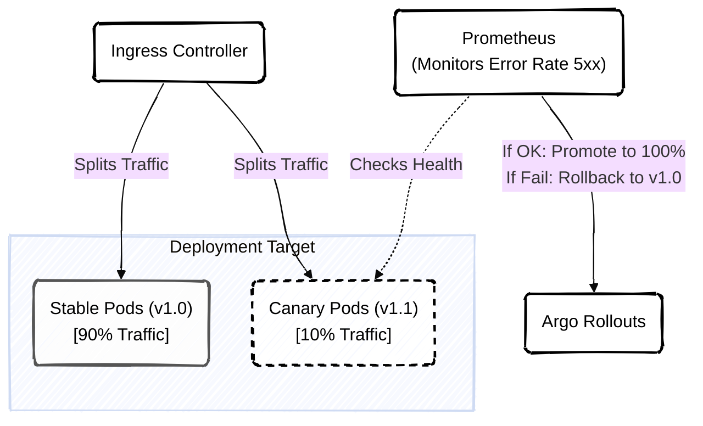

# Инфраструктура и Процесс Развертывания (GitOps CI/CD)



>[!IMPORTANT]
> Инфраструктура STREMO управляется по принципу **GitOps**. Это означает, что конфигурация всего Kubernetes-кластера (Deployment, Service, ConfigMap, Ingress) описана в виде манифестов в репозитории `infra`. Прямые изменения кластера через `kubectl apply` строго запрещены.

---

## **1. CI/CD Пайплайн (Continuous Integration / Deployment)**

Мы используем двухконтурный процесс: GitLab CI (или GitHub Actions) для сборки кода (CI) и ArgoCD / FluxCD для синхронизации состояния кластера (CD).



### **1.1. Этап CI (Сборка)**
1.  При пуше в ветку `main` микросервиса запускается пайплайн.
2.  Запускаются Unit-тесты и статический анализатор кода (SonarQube).
3.  Собирается Docker-образ. В качестве базового образа для C++ микросервисов используется `alpine` или `distroless` для минимизации размера и поверхности атак.
4.  Собранный образ пушится в Container Registry с тегом коммита (например, `v1.2.4-a1b2c3d`).
5.  CI-скрипт автоматически делает коммит в инфраструктурный репозиторий `infra`, заменяя старый тег образа на новый в файлах Kustomize.

### **1.2. Этап CD (Доставка)**
ArgoCD (или аналогичный GitOps агент), запущенный внутри самого кластера Kubernetes, раз в минуту опрашивает репозиторий `infra`. Как только он видит новый коммит (обновился тег образа), он автоматически применяет эти изменения к кластеру, запуская Rolling Update.

---

## **2. Управление Средами (Environments)**

Проект `infra` структурирован с использованием **Kustomize** (встроен в kubectl). Это позволяет иметь общую базу (base) для всех сервисов и накладывать патчи (overlays) для конкретных сред.

Структура директорий:
```text
infra/
├── apps/
│   ├── base/
│   │   ├── auth-service/ (deployment.yaml, svc.yaml)
│   │   ├── chat-service/
│   └── overlays/
│       ├── dev/ (Меняет replicas: 1, ресурсы CPU/RAM)
│       ├── stage/ (Подключает тестовую БД)
│       └── prod/ (Меняет replicas: 10, подключает HPA, Production БД)
```

>[!NOTE]
> Среда `stage` (Staging) является точной зеркальной копией `prod` (по архитектуре, но не по мощностям). На нее направляется копия продакшен-трафика (Shadow Traffic) через Ingress Nginx для проверки сервисов под реальной нагрузкой перед релизом в прод.

---

## **3. Стратегия релиза без простоев (Zero-Downtime Deployment)**

Поскольку STREMO — это платформа реального времени, отключение API даже на 5 секунд приведет к разрыву стримов. Мы применяем стратегии постепенного выкатывания.

### **3.1. Canary Deployments (Канареечные релизы)**

Для критически важных компонентов (например, API Gateway или Auth Service) используется Canary-выкладка (через Argo Rollouts).



**Процесс:**
1.  ArgoCD запускает всего несколько подов с новой версией приложения (v1.1).
2.  Ingress-контроллер перенаправляет на новые поды только 5-10% пользовательского трафика.
3.  Система ждет 5 минут и анализирует метрики в Prometheus. Если количество ошибок HTTP 5xx на новых подах не превышает норму, трафик увеличивается до 50%, а затем до 100%.
4.  Старые поды (v1.0) уничтожаются.

>[!CAUTION]
> **Ограничение для WebSocket**
> Канареечные релизы сложны для `chat-service` (WebSockets). Существующие WS-соединения не могут быть плавно перенесены. Для чат-подов используется стратегия медленного Rolling Update: поды убиваются по одному. Клиент (браузер) замечает разрыв, использует экспоненциальную задержку (Exponential Backoff) и переподключается уже к новому, обновленному поду.
