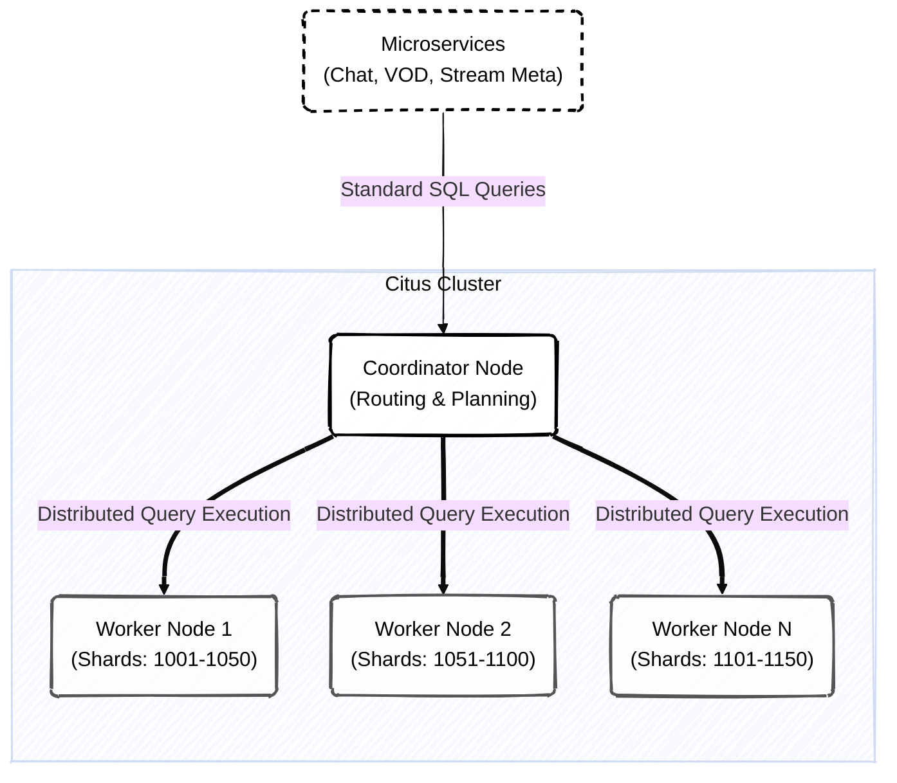
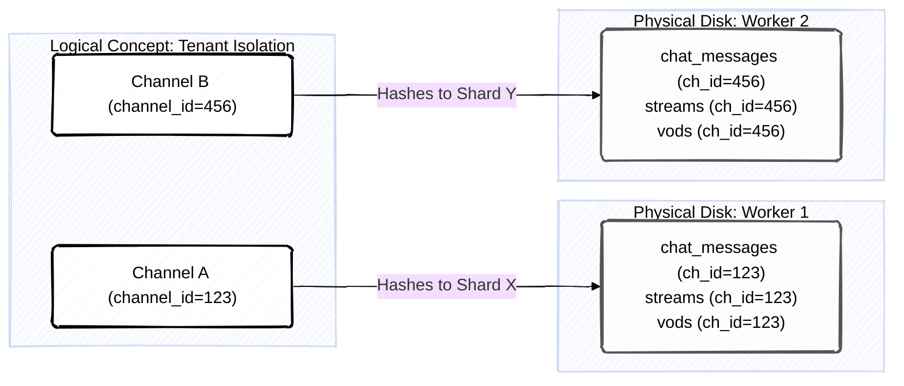
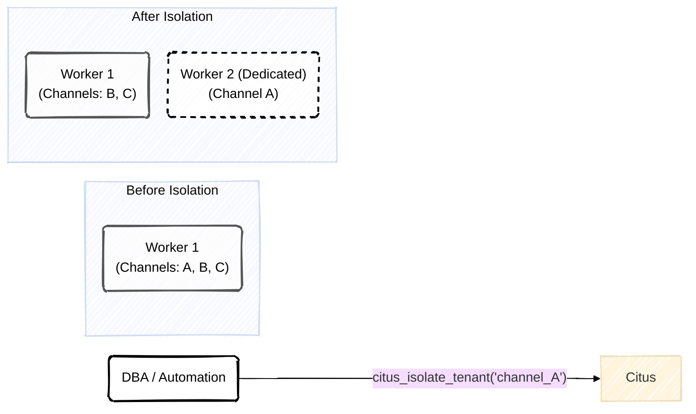

# Стратегия Шардирования (Sharding Strategy)

>[!IMPORTANT]
> В высоконагруженных стриминговых системах объем генерируемых данных (особенно в чатах трансляций) мгновенно превышает возможности вертикального масштабирования (Scale-Up). Данный документ описывает механизмы горизонтального масштабирования (Scale-Out) с использованием кластера **PostgreSQL + Citus Data**.

---

## **1. Архитектура Распределенной Базы Данных Citus**

Citus превращает PostgreSQL в распределенную СУБД, состоящую из одного Coordinator-узла и множества Worker-узлов. Приложение (наши микросервисы) общается только с Coordinator-ом, думая, что работает с обычной локальной базой Postgres.

### **1.1. Маршрутизация запросов**
Когда `chat-service` отправляет запрос `SELECT * FROM chat_messages WHERE channel_id = 'user-123'`, Coordinator вычисляет хэш от `user-123`, определяет, на каком Worker-узле находится нужный шард, и прозрачно проксирует запрос именно туда, минуя остальные сервера.

---

## **2. Выбор Ключа Распределения (Sharding Key)**

Фундаментальное правило шардирования: **данные, которые запрашиваются вместе, должны лежать вместе (на одном физическом диске)**.

Мы используем `channel_id` (ID стримера) в качестве единого ключа распределения (Distribution Column) для всех высоконагруженных таблиц (чаты, статистика, клипы). Это позволяет Citus выполнять операции `JOIN` локально на Worker-узлах без необходимости пересылать терабайты данных по сети (Network Shuffle).

>[!TIP]
> **Co-location (Совместное размещение)**
> Запрос вида `SELECT c.text, s.title FROM chat_messages c JOIN streams s ON c.channel_id = s.channel_id WHERE c.channel_id = '123'` выполнится за миллисекунды, так как обе таблицы для этого канала физически лежат на `Worker 1`.

---

## **3. Reference Tables (Справочные таблицы)**

Некоторые таблицы (например, `categories` со списком игр или `badges` со значками модераторов) нужны часто, но они слишком малы для шардирования по ключу.

В Citus они помечаются как **Reference Tables**. Координатор автоматически создает полную копию (реплику) таких таблиц на **каждом** Worker-узле. Это позволяет делать JOIN шардированных таблиц (чат) со справочными (значки) без сетевых задержек.

---

## **4. Решение проблемы Hotspots (Горячие точки)**

Самая опасная ситуация при шардировании по `channel_id` — запуск стрима топовым киберспортсменом с онлайном 300,000 зрителей. В этот момент один конкретный `channel_id` сгенерирует 90% нагрузки всей платформы, и Worker, на котором лежит его шард, может упасть (Hotspot).

### **4.1. Смягчение нагрузки (Mitigation Strategies)**

1.  **Batching на уровне приложения:** `chat-service` не пишет сообщения в БД поштучно. Он аккумулирует их в RAM и делает один Bulk Insert раз в 500мс. Даже 10,000 сообщений превратятся всего в 2 запроса к Worker-узлу.
2.  **Tenant Isolation (Изоляция тенанта):** С помощью функции `citus_isolate_tenant()` мы можем на лету "вырезать" шард крупного стримера из общего Worker-узла и перенести его на отдельный, выделенный сверхмощный сервер без остановки записи.

>[!CAUTION]
> **Мониторинг шардов**
> SRE команда обязана настроить алерты в Grafana на CPU/IOPS каждого отдельного Citus Worker. Если утилизация диска (IO Wait) на одном воркере превышает 80% в течение 2 минут, запускается скрипт автоматической изоляции горячего шарда.
