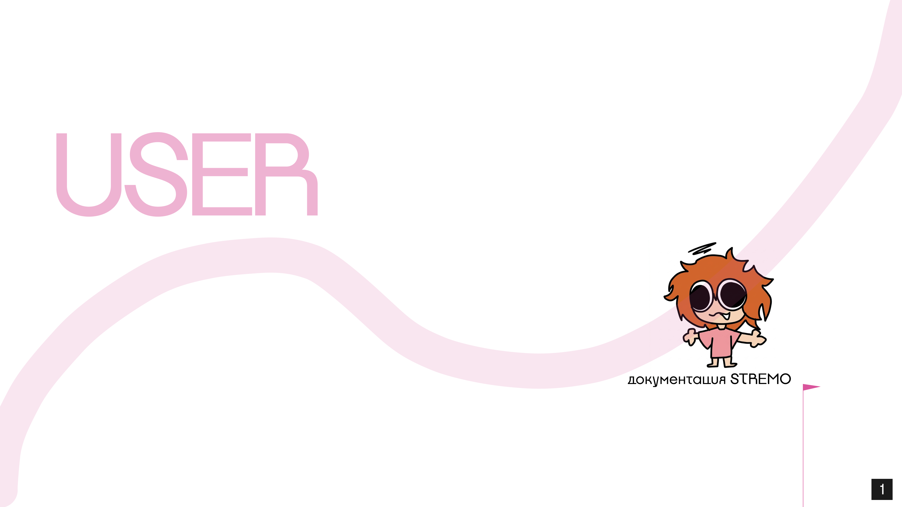
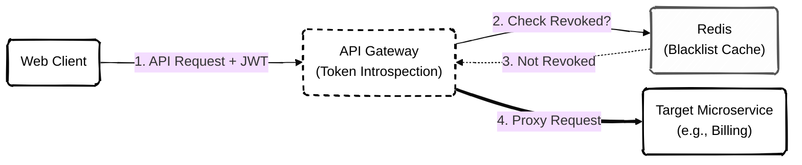

# Жизненный Цикл Пользователя и Ролевая Модель



>[!IMPORTANT]
> Данный документ описывает абстракцию "Пользователь" (User) с точки зрения архитектуры платформы. Он включает диаграмму состояний учетной записи (State Machine), сессионный менеджмент и ролевую модель доступа (RBAC).

---

## **1. Модель Состояний (State Machine)**

Пользователь в системе не статичен. В зависимости от уровня верификации и нарушений правил, его аккаунт переходит между жестко заданными состояниями. Маршрутизация на API Gateway (BFF) проверяет текущее состояние пользователя при каждом запросе.

```mermaid
%%{init: {"theme": "base", "look": "handDrawn"}}%%
stateDiagram-v2
    classDef default fill:#fff,stroke:#000,stroke-width:2px,color:#000
    classDef danger fill:#fff,stroke:#d63031,stroke-width:2px,stroke-dasharray: 6 6,color:#d63031,rx:15,ry:15

    [*] --> Anonymous : Вход на сайт
    Anonymous --> Unverified : Регистрация (POST /register)
    
    Unverified --> Verified : Подтверждение Email / Mobile ID
    Verified --> Affiliate : Выполнение условий платформы
    Affiliate --> Partner : Контракт со STREMO
    
    Verified --> Banned : Нарушение правил (Модерация)
    Affiliate --> Banned : Нарушение правил
    Partner --> Banned : Разрыв контракта / Нарушение
    
    Banned --> Verified : Апелляция одобрена
    Banned --> Deleted : Перманентный бан (Hard Delete)
    
    Verified --> Deleted : Пользователь удалил аккаунт
    Deleted --> [*]
```

### **Описание состояний:**
*   **Anonymous:** Гость. Имеет доступ к чтению каталога (`GET /streams/live`) и просмотру трансляций. Может читать чат через WS, но не может писать.
*   **Unverified:** Зарегистрированный аккаунт без подтвержденного Email/Телефона. Запрещен запуск трансляций и совершение покупок (защита от бот-сетей).
*   **Verified:** Полноценный пользователь. Может донатить, писать в чат и запускать базовые стримы без возможности монетизации (без рекламы).
*   **Affiliate / Partner:** Статусы стримеров. Открывают доступ к выплатам, кнопке подписки на канал (Tier 1/2/3) и кастомным смайликам.
*   **Banned:** Доступ к API заблокирован на уровне Ingress (код `403 Forbidden`). При попытке входа или обновления токена запрос отклоняется.

---

## **2. Ролевая Модель Контроля Доступа (RBAC)**

Авторизация реализована на основе ролей (Role-Based Access Control). Роли вшиваются в полезную нагрузку (Payload) JWT-токена при входе в систему (вызов `POST /login`).

### **2.1. Иерархия Ролей**

| Роль (Role) | Глобальные права | Локальные права (Channel Scope) |
| :--- | :--- | :--- |
| `user` | Базовый доступ. | Нет. |
| `moderator` | Нет глобальных прав. | Имеет право выдавать таймауты и баны (`POST /ban`) только в чате того стримера, который назначил его модератором. |
| `admin` | Чтение логов, блокировка пользователей. | Может управлять любым каналом. |
| `superadmin` | Изменение конфигураций платформы. | Полный доступ. |

### **2.2. JWT и Scope-базированая Авторизация**

Чтобы микросервисы (например, `chat-service`) не делали запрос в БД для проверки прав при каждом сообщении пользователя, вся информация криптографически подписана внутри JWT токена.

Пример расшифрованного Payload:
```json
{
  "sub": "usr-12345",
  "username": "viewer99",
  "status": "verified",
  "global_roles": ["user"],
  "channel_roles": {
    "channel_id_789": ["moderator"],
    "channel_id_101": ["vip"]
  },
  "exp": 1716249600
}
```

>[!TIP]
> **Проверка прав в Микросервисах**
> Когда пользователь отправляет запрос на бан другого зрителя (эндпоинт `/moderation/channels/789/ban`), микросервис Модерации просто извлекает JWT заголовок, парсит его (проверяя подпись) и смотрит, есть ли у пользователя роль `moderator` в массиве `channel_roles["channel_id_789"]`. Дополнительного похода в БД не требуется.

---

## **3. Менеджмент Сессий и Безопасность**

Платформа использует паттерн **Short-Lived Access Token + Long-Lived Refresh Token**.

1.  **Access Token (JWT):** Живет всего 15 минут. Хранится в памяти браузера фронтенда (не в LocalStorage, чтобы избежать XSS атак). Отправляется в каждом запросе в заголовке `Authorization: Bearer`.
2.  **Refresh Token:** Живет 30 дней. Хранится в браузере в виде `HttpOnly; Secure; SameSite=Strict` Cookie. Недоступен для JavaScript. 

### **3.1. Отзыв сессий (Token Revocation & Blacklisting)**

Классическая проблема JWT — невозможность отозвать токен до истечения его срока жизни (15 минут). Если пользователь меняет пароль или его банит администратор, злоумышленник может использовать украденный Access Token еще 15 минут.

**Решение STREMO (Redis Blacklist):**
*   При сбросе пароля или бане, `user_id` пользователя помещается в Redis с ключом `blacklist:usr-12345` и TTL = 15 минут.
*   API Gateway (BFF) перед пересылкой запроса внутренним сервисам быстро (за 1-2 мс) проверяет наличие пользователя в Redis Blacklist. Если он там есть — запрос отклоняется с `401 Unauthorized`, заставляя клиента запросить новый токен (который не выдадут из-за измененного пароля/бана).



>[!CAUTION]
> **Безопасность Транзакций**
> Любые операции по списанию средств (донат, подписка) требуют обязательной валидации сессии на уровне `billing-service`. Даже если JWT прошел валидацию на Gateway, биллинг повторно проверит целостность аккаунта в глобальной БД перед транзакцией.
